# Smart Academy Platform - Vue Globale d'Architecture

## Diagramme d'Architecture Complète

```mermaid
graph TB
    subgraph "🌐 External Integrations"
        MOODLE[("🎓 Moodle LMS<br/>OAuth2 REST API")]
        CANVAS[("📚 Canvas LMS<br/>REST API")]
        OPENAI[("🤖 OpenAI API<br/>GPT Models")]
    end
    
    subgraph "📱 Client Layer - Frontend Applications"
        subgraph "Student Coach Mobile"
            FLUTTER["Flutter 3.x<br/>:3001<br/>━━━━━━━<br/>Riverpod State<br/>Dio HTTP Client<br/>fl_chart<br/>━━━━━━━<br/>📱 iOS/Android"]
        end
        
        subgraph "Teacher Console Web"
            REACT["React 18<br/>:3002<br/>━━━━━━━<br/>Chart.js<br/>Axios<br/>Material-UI<br/>Vite<br/>━━━━━━━<br/>🖥️ Web Browser"]
        end
    end
    
    subgraph "🚪 API Gateway Layer"
        GATEWAY["API Gateway<br/>:8888<br/>━━━━━━━━━<br/>Spring Cloud Gateway<br/>JWT Validation<br/>CORS Config<br/>Route Management"]
    end
    
    subgraph "🔍 Service Discovery"
        EUREKA["Eureka Server<br/>:8761<br/>━━━━━━━━━<br/>Service Registry<br/>Health Checks<br/>Load Balancing"]
    end
    
    subgraph "☕ Spring Boot Microservices"
        subgraph "User Management :8082"
            UM_SEC["🔐 Security Layer<br/>━━━━━━━<br/>JWT Auth<br/>Spring Security<br/>RBAC"]
            UM_BIZ["💼 Business Layer<br/>━━━━━━━<br/>Controller<br/>Service<br/>Repository"]
            UM_DB[("PostgreSQL<br/>User DB :5435<br/>━━━━━━━<br/>Flyway Migrations")]
            
            UM_SEC --> UM_BIZ --> UM_DB
        end
        
        subgraph "Course Management :8081"
            CM_SEC["🔐 Security Layer<br/>━━━━━━━<br/>JWT Validation"]
            CM_BIZ["💼 Business Layer<br/>━━━━━━━<br/>Controller<br/>Service<br/>Repository"]
            CM_DB[("PostgreSQL<br/>Course DB :5432<br/>━━━━━━━<br/>Flyway Migrations")]
            
            CM_SEC --> CM_BIZ --> CM_DB
        end
    end
    
    subgraph "🟢 Node.js Service"
        subgraph "LMS Connector :3000"
            LMS_CTRL["Controller Layer<br/>━━━━━━━<br/>NestJS Controllers<br/>OAuth2 Client"]
            LMS_SRV["Service Layer<br/>━━━━━━━<br/>Ingestion Service<br/>Transformation Logic"]
            LMS_REPO["Repository Layer<br/>━━━━━━━<br/>TypeORM Entities"]
            LMS_DB[("PostgreSQL<br/>LMS DB :5433")]
            
            LMS_CTRL --> LMS_SRV --> LMS_REPO --> LMS_DB
        end
    end
    
    subgraph "🐍 Python AI Microservices"
        subgraph "PrepaData :8001"
            PD["FastAPI<br/>━━━━━━━<br/>Data Normalization<br/>Pandas<br/>Engagement Metrics"]
        end
        
        subgraph "StudentProfiler :8002"
            SP["FastAPI<br/>━━━━━━━<br/>Student Clustering<br/>KMeans + PCA<br/>Scikit-learn"]
        end
        
        subgraph "PathPredictor :8003"
            PP["FastAPI<br/>━━━━━━━<br/>Risk Prediction<br/>XGBoost<br/>MLflow Tracking"]
        end
        
        subgraph "RecoBuilder :8004"
            RB["FastAPI<br/>━━━━━━━<br/>Recommendations<br/>BERT + Faiss<br/>Transformers"]
        end
    end
    
    subgraph "Chatbot Service"
        CHATBOT["Chatbot-edu :8005<br/>━━━━━━━<br/>FastAPI + RAG<br/>LangChain<br/>Vector Search"]
    end
    
    subgraph "🗄️ Infrastructure Services"
        MINIO[("MinIO Object Storage<br/>:9000/:9001<br/>━━━━━━━━━<br/>📄 PDFs<br/>🎥 Videos<br/>📊 ML Models")]
        
        RABBITMQ[("RabbitMQ<br/>:5672/:15672<br/>━━━━━━━━━<br/>Async Messaging<br/>📧 Email Queue<br/>📊 Analytics Queue")]
    end
    
    %% Client to Gateway
    FLUTTER -.->|HTTPS| GATEWAY
    REACT -.->|HTTPS| GATEWAY
    
    %% Gateway to Services
    GATEWAY -->|Route: /user-management-service/**| UM_SEC
    GATEWAY -->|Route: /course-service/**| CM_SEC
    GATEWAY -->|Route: /lmsconnector/**| LMS_CTRL
    GATEWAY -->|Route: /prepadata-service/**| PD
    GATEWAY -->|Route: /studentprofiler-service/**| SP
    GATEWAY -->|Route: /pathpredictor-service/**| PP
    GATEWAY -->|Route: /recobuilder-service/**| RB
    GATEWAY -->|Route: /chatbot-edu-service/**| CHATBOT
    
    %% Service Discovery
    EUREKA -.->|Register| GATEWAY
    EUREKA -.->|Register| UM_BIZ
    EUREKA -.->|Register| CM_BIZ
    EUREKA -.->|Register| LMS_SRV
    EUREKA -.->|Register| PD
    EUREKA -.->|Register| SP
    EUREKA -.->|Register| PP
    EUREKA -.->|Register| RB
    EUREKA -.->|Register| CHATBOT
    
    %% External Integrations
    LMS_SRV <-->|OAuth2 + REST| MOODLE
    LMS_SRV <-->|REST| CANVAS
    CHATBOT -->|API Calls| OPENAI
    RB -->|Embeddings| OPENAI
    
    %% AI Pipeline Data Flow
    PD -->|Fetch Normalized Data| LMS_SRV
    SP -->|Consume Metrics| PD
    PP -->|Consume Metrics| PD
    RB -->|Consume Profiles & Predictions| SP
    RB -->|Consume Predictions| PP
    
    %% Infrastructure Connections
    UM_BIZ -->|Publish Events| RABBITMQ
    CM_BIZ -->|Publish Events| RABBITMQ
    CHATBOT -->|Store/Retrieve Files| MINIO
    RB -->|Store ML Models| MINIO
    
    %% Styling
    classDef springBoot fill:#6AAE4E,stroke:#4A7C34,stroke-width:3px,color:#fff
    classDef nodejs fill:#68A063,stroke:#3C6E45,stroke-width:3px,color:#fff
    classDef python fill:#FFB84D,stroke:#CC8A00,stroke-width:3px,color:#000
    classDef frontend fill:#E91E63,stroke:#AD1457,stroke-width:3px,color:#fff
    classDef infrastructure fill:#607D8B,stroke:#455A64,stroke-width:3px,color:#fff
    classDef gateway fill:#FF9800,stroke:#E65100,stroke-width:3px,color:#fff
    classDef discovery fill:#9C27B0,stroke:#6A1B9A,stroke-width:3px,color:#fff
    classDef external fill:#2196F3,stroke:#1565C0,stroke-width:3px,color:#fff
    classDef database fill:#00BCD4,stroke:#00838F,stroke-width:2px,color:#fff
    
    class UM_SEC,UM_BIZ,CM_SEC,CM_BIZ springBoot
    class LMS_CTRL,LMS_SRV,LMS_REPO nodejs
    class PD,SP,PP,RB,CHATBOT python
    class FLUTTER,REACT frontend
    class MINIO,RABBITMQ infrastructure
    class GATEWAY gateway
    class EUREKA discovery
    class MOODLE,CANVAS,OPENAI external
    class UM_DB,CM_DB,LMS_DB database
```

## 📊 Vue Détaillée par Couches

### Couche Client (Frontend)

### Couche Services Backend

### Pipeline AI & Analytics

```mermaid
graph LR
    MOODLE["🎓 Moodle<br/>Raw Data"]
    
    LMS["LMS Connector<br/>:3000<br/>━━━━━<br/>Extract & Normalize"]
    
    PD["PrepaData<br/>:8001<br/>━━━━━<br/>Clean & Aggregate<br/>Calculate Metrics"]
    
    SP["StudentProfiler<br/>:8002<br/>━━━━━<br/>Clustering<br/>Profile Types"]
    
    PP["PathPredictor<br/>:8003<br/>━━━━━<br/>Risk Prediction<br/>Success Probability"]
    
    RB["RecoBuilder<br/>:8004<br/>━━━━━<br/>Personalized<br/>Recommendations"]
    
    TC["👨‍🏫 Teacher Console<br/>Visualizations"]
    SC["👨‍🎓 Student Coach<br/>Personalized View"]
    
    MOODLE -->|OAuth2| LMS
    LMS -->|Normalized Data| PD
    PD -->|Engagement Metrics| SP
    PD -->|Performance Data| PP
    SP -->|Student Profiles| RB
    PP -->|Risk Scores| RB
    RB -->|Recommendations| TC
    RB -->|Recommendations| SC
    SP -->|Profile Types| TC
    PP -->|Alerts| TC
    
    classDef source fill:#4CAF50,stroke:#2E7D32,stroke-width:2px,color:#fff
    classDef process fill:#FF9800,stroke:#E65100,stroke-width:2px,color:#000
    classDef destination fill:#E91E63,stroke:#AD1457,stroke-width:2px,color:#fff
    
    class MOODLE source
    class LMS,PD,SP,PP,RB process
    class TC,SC destination
```

## 🔐 Flux d'Authentication JWT

```mermaid
sequenceDiagram
    participant U as 👤 User<br/>(Web/Mobile)
    participant GW as 🚪 API Gateway<br/>:8888
    participant UM as 🔐 User Management<br/>:8082
    participant DB as 💾 User DB
    participant CS as 📚 Course Service<br/>:8081
    
    U->>GW: POST /user-management-service/api/v1/auth/login<br/>{email, password}
    GW->>UM: Forward request
    UM->>DB: SELECT user WHERE email = ?
    DB-->>UM: User record
    UM->>UM: Validate password (BCrypt)
    UM->>UM: Generate JWT tokens<br/>(access + refresh)
    UM->>DB: INSERT refresh_token
    UM-->>GW: {accessToken, refreshToken, user}
    GW-->>U: 200 OK + tokens
    
    Note over U: Store tokens in<br/>localStorage/SecureStorage
    
    U->>GW: GET /course-service/api/courses<br/>Authorization: Bearer <token>
    GW->>GW: Validate JWT signature<br/>Extract userId & role
    GW->>CS: Forward with validated JWT
    CS->>CS: Check permissions<br/>(role = STUDENT/TEACHER)
    CS-->>GW: {courses: [...]}
    GW-->>U: 200 OK + courses
```

## 📨 Flux Async avec RabbitMQ

```mermaid
graph TB
    subgraph "Publishers"
        UM_PUB["User Management<br/>━━━━━<br/>UserCreatedEvent<br/>PasswordResetEvent"]
        CM_PUB["Course Management<br/>━━━━━<br/>StudentEnrolledEvent<br/>QuizSubmittedEvent"]
    end
    
    subgraph "RabbitMQ Broker"
        EX_USER["user.exchange<br/>(Topic)"]
        EX_COURSE["course.exchange<br/>(Topic)"]
        EX_NOTIF["notification.fanout<br/>(Fanout)"]
        
        Q_EMAIL["📧 email.queue"]
        Q_ANALYTICS["📊 analytics.queue"]
        Q_PUSH["📱 push.queue"]
        Q_SMS["💬 sms.queue"]
    end
    
    subgraph "Consumers"
        EMAIL_SRV["Email Service<br/>━━━━━<br/>Send SMTP Emails"]
        ANALYTICS["Analytics Service<br/>━━━━━<br/>Track Metrics"]
        PUSH_SRV["Push Notification<br/>━━━━━<br/>Firebase FCM"]
        SMS_SRV["SMS Service<br/>━━━━━<br/>Twilio API"]
    end
    
    UM_PUB -->|Publish| EX_USER
    CM_PUB -->|Publish| EX_COURSE
    
    EX_USER -->|Route| Q_EMAIL
    EX_COURSE -->|Route| Q_ANALYTICS
    
    EX_USER -.->|Fanout| EX_NOTIF
    EX_NOTIF -.-> Q_EMAIL
    EX_NOTIF -.-> Q_PUSH
    EX_NOTIF -.-> Q_SMS
    
    Q_EMAIL --> EMAIL_SRV
    Q_ANALYTICS --> ANALYTICS
    Q_PUSH --> PUSH_SRV
    Q_SMS --> SMS_SRV
    
    classDef publisher fill:#4CAF50,stroke:#2E7D32,stroke-width:2px,color:#fff
    classDef broker fill:#FF9800,stroke:#E65100,stroke-width:2px,color:#000
    classDef consumer fill:#2196F3,stroke:#1565C0,stroke-width:2px,color:#fff
    
    class UM_PUB,CM_PUB publisher
    class EX_USER,EX_COURSE,EX_NOTIF,Q_EMAIL,Q_ANALYTICS,Q_PUSH,Q_SMS broker
    class EMAIL_SRV,ANALYTICS,PUSH_SRV,SMS_SRV consumer
```

## 🗂️ Structure de Données

### Base de Données User Management

### Base de Données Course Management

### Base de Données LMS Connector

## 🚀 Deployment Architecture

## 📈 Scalabilité & Performance

| Service | Instances (Dev) | Instances (Prod) | Stratégie de Scaling |
|---------|----------------|------------------|---------------------|
| **API Gateway** | 1 | 3+ | Horizontal (Load Balancer) |
| **Eureka Server** | 1 | 3 | Peer-to-peer replication |
| **User Management** | 1 | 3+ | Horizontal (Eureka LB) |
| **Course Management** | 1 | 3+ | Horizontal (Eureka LB) |
| **LMS Connector** | 1 | 2+ | Horizontal (Eureka LB) |
| **AI Services** | 1 each | 2 each | Vertical (CPU/RAM pour ML) |
| **PostgreSQL** | 1 | 1 Master + 2 Replicas | Master-Replica replication |
| **MinIO** | 1 | 4+ nodes | Distributed mode (erasure coding) |
| **RabbitMQ** | 1 | 3 nodes | Cluster avec mirroring |

## 🔧 Technologies Récapitulatif

| Catégorie | Technologies |
|-----------|-------------|
| **Backend Java** | Spring Boot 3.2.5, Spring Security, Spring Data JPA, Spring Cloud Gateway |
| **Backend Node.js** | NestJS 11, TypeORM, Passport-JWT, eureka-js-client |
| **Backend Python** | FastAPI, Pandas, Scikit-learn, XGBoost, Transformers, MLflow |
| **Frontend Web** | React 18, Chart.js, Axios, Material-UI, Vite |
| **Frontend Mobile** | Flutter 3, Riverpod, Dio, fl_chart |
| **Databases** | PostgreSQL 15, Flyway Migrations |
| **Storage** | MinIO (S3-compatible) |
| **Messaging** | RabbitMQ AMQP |
| **Service Discovery** | Netflix Eureka |
| **Containerization** | Docker, Docker Compose, Kubernetes-ready |
| **Monitoring** | Spring Actuator, Prometheus-ready, Health checks |

---

**Version**: 1.0  
**Date**: 24 Décembre 2025  
**Auteur**: Smart Academy Architecture Team  
**Status**: ✅ Production Ready
